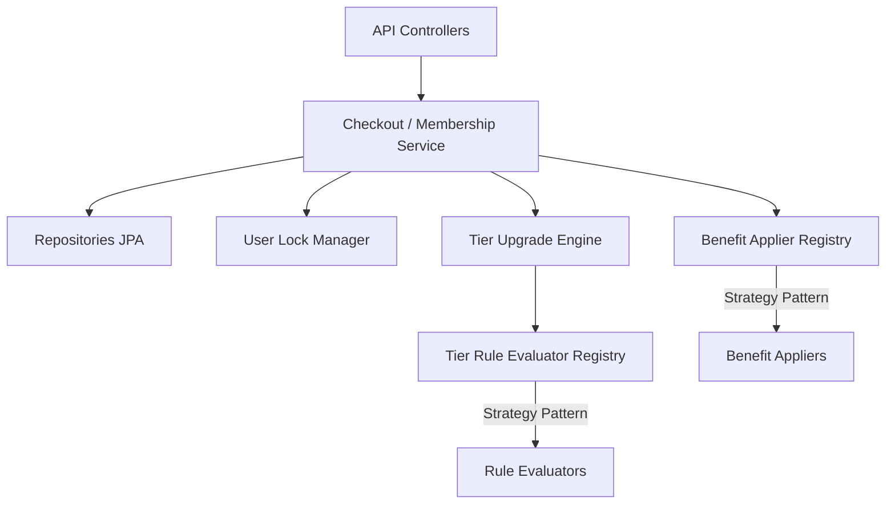
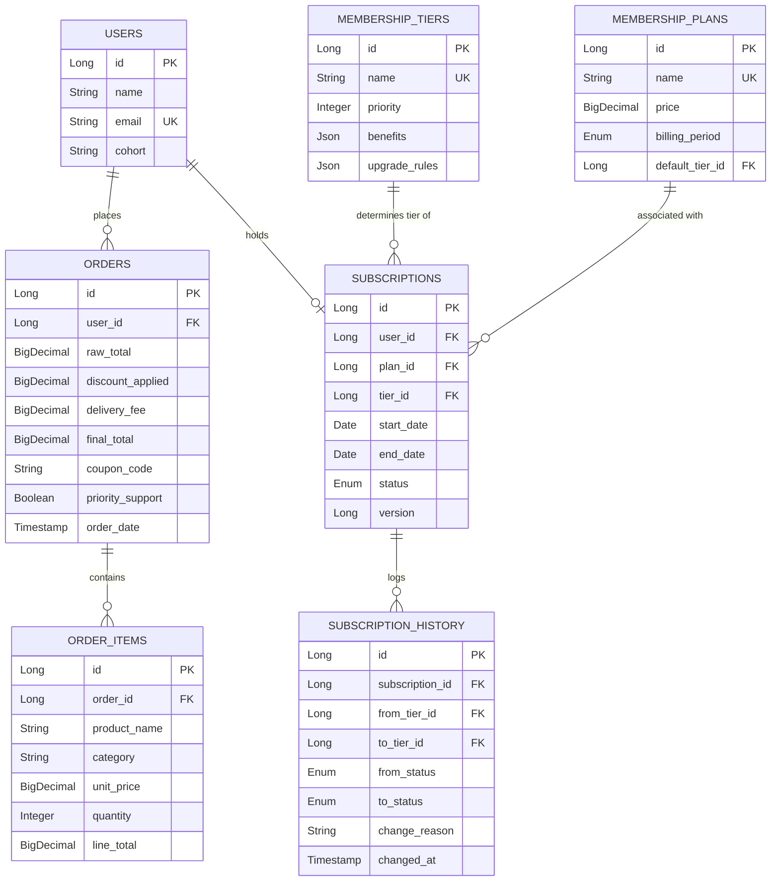

# FirstClub Membership Program Backend

FirstClub is a high-performance, modular Spring Boot application designed to manage dynamic membership subscriptions, evaluate tier upgrade rules, and apply member-specific benefits during checkout. 

The system is built on modern architectural principles, featuring a dynamic **Strategy-based Rule & Benefit engine**, **Java 21 Virtual Thread-driven async upgrades**, and a lock-outside-transaction concurrency model to guarantee safety under high concurrent loads.

---

## 🚀 Key Features

*   **Dynamic Tier & Plan Architecture**: Allows flexible definitions of membership tiers (SILVER, GOLD, PLATINUM) with priorities, distinct rule configurations, and tiered benefits.
*   **Strategy-Pattern Engine**:
    *   **Rule Evaluators**: Decoupled rules (`ORDER_COUNT_THRESHOLD`, `MONTHLY_SPEND_THRESHOLD`, `COHORT_MATCH`) that evaluate user data dynamically under `AND` or `OR` logical operators.
    *   **Benefit Appliers**: Configurable benefits (`PERCENTAGE_DISCOUNT`, `FREE_DELIVERY`, `EXCLUSIVE_COUPON`, `PRIORITY_SUPPORT`) mapped to orders during calculation and checkout.
*   **Virtual Thread Concurrency**: Processes asynchronous tier upgrades in the background using Java 21 Virtual Threads, minimizing latency for the checkout critical path.
*   **Thread Safety with Striped Locking**: Employs Guava `Striped<Lock>` in a lock-outside-transaction pattern, serialized per user, preventing race conditions, optimistic locking failures, and duplicate history records.
*   **Rigorous Test Suite**: Backed by 59 unit, integration, and concurrency tests ensuring high logic coverage, error mappings, and transactional consistency.

---

## 🏗️ Architecture & Component Design

The application follows a clean layered architecture with a decoupled registry-strategy model for rules and benefits:



### 1. Strategy & Registry Patterns
Instead of hardcoding rules and benefits, the system uses registries that scan and register implementations of `TierRuleEvaluator` and `BenefitApplier`. 
*   **Rule Configs & Benefit Configs** are stored as JSON structures inside the database, mapping class-independent parameters (e.g. `discountPercent`, `thresholdAmount`) to execution.
*   Supports dynamic combining of rules. For example, a tier can require `(Rule A OR Rule B) AND Rule C` depending on the configured operator parameter.

### 2. Concurrency Control (UserLockManager)
To avoid multiple concurrent checkouts from triggering overlapping upgrades for the same user (which leads to duplicate history logs and `ObjectOptimisticLockingFailureException`), we use a specialized lock manager:
```java
public class UserLockManager {
    private final Striped<Lock> striped = Striped.lock(256);
    
    public <T> T executeWithLock(Long userId, Supplier<T> action) {
        Lock lock = striped.get(userId);
        lock.lock();
        try {
            return action.get();
        } finally {
            lock.unlock();
        }
    }
}
```
*   Locks are held **outside** of Spring transactions. This avoids holding DB connection pool resources while blocking, preventing database deadlocks.
*   The actual database state modification propagates in a new transaction (`Propagation.REQUIRES_NEW`), which executes cleanly inside the lock boundary.

---

## 💾 Database Schema

The database model tracks users, orders, plans, subscriptions, and their chronological history.



---

## 🛠️ Getting Started & Running

### Prerequisites
*   **Java 21** (Required for virtual thread Support)
*   **Maven 3.8+** or the included `./mvnw` wrapper

### 1. Build the Project
```bash
./mvnw clean package
```

### 2. Run the Application
The application will automatically boot up and run on `http://localhost:8080`.
```bash
./mvnw spring-boot:run
```
*Note: The application has a `DataSeeder` which automatically populates standard tiers (SILVER, GOLD, PLATINUM), plans (Monthly Basic, Quarterly Plus, Yearly Premium), and seed users on start if the database is empty.*

---

## 🧪 Testing

The test suite contains **59 comprehensive unit and integration tests** checking:
1.  **Controller REST Mappings & Error Handling** (MockMvc)
2.  **Order Calculation & Capping Boundaries** (e.g. capping discount total to raw total)
3.  **Tier Upgrade Priority & Upgrade Engine Logic**
4.  **Virtual Thread Concurrency & Striped Locking Execution**
5.  **Strategy Parameter Edge Cases & Registry Failures**

Run the complete test suite:
```bash
./mvnw test
```

---

## 🔌 API Endpoints Reference

### 1. User Management
*   `GET /api/users`: Retrieve all registered users.
*   `GET /api/users/{id}`: Retrieve a specific user by ID.
*   `POST /api/users`: Create a new user.
    *   *Request Body:*
        ```json
        {
          "name": "Alex Smith",
          "email": "alex@test.com",
          "cohort": "PREMIUM_COHORT"
        }
        ```

### 2. Membership Management
*   `GET /api/memberships/plans`: List all available subscription plans.
*   `GET /api/memberships/tiers`: List all membership tiers sorted by priority.
*   `GET /api/memberships/{userId}/status`: Retrieve the subscription details, benefits list, and progress metrics toward the next tier for a user.
*   `POST /api/memberships/subscribe`: Subscribes a user to a plan.
    *   *Request Body:*
        ```json
        {
          "userId": 1,
          "planId": 2
        }
        ```
*   `PATCH /api/memberships/{userId}/tier`: Manually upgrade or downgrade a user's tier.
    *   *Request Body:*
        ```json
        {
          "tierId": 3
        }
        ```
*   `DELETE /api/memberships/{userId}`: Cancel a user's active subscription.

### 3. Checkout Operations
*   `POST /api/checkout/calculate`: Pre-calculates discounts, delivery fees, and unlocks coupon codes based on a user's membership tier without placing the order.
    *   *Request Body:*
        ```json
        {
          "userId": 1,
          "deliveryFee": 50.00,
          "items": [
            {
              "productName": "Keyboard",
              "category": "Electronics",
              "unitPrice": 1200.00,
              "quantity": 1
            }
          ]
        }
        ```
*   `POST /api/checkout/place-order`: Performs the calculation, records the order and its items in the database, and schedules a background virtual thread to evaluate tier upgrades.

### 4. Concurrency Sandbox (Demo Only)
*   `POST /api/demo/concurrency-test`: Launches virtual threads concurrently placing orders for a user. Helps demonstrate the striped locking manager sequentializing upgrades correctly under heavy concurrent operations.
    *   *Request Body:*
        ```json
        {
          "userId": 1,
          "threads": 10
        }
        ```
