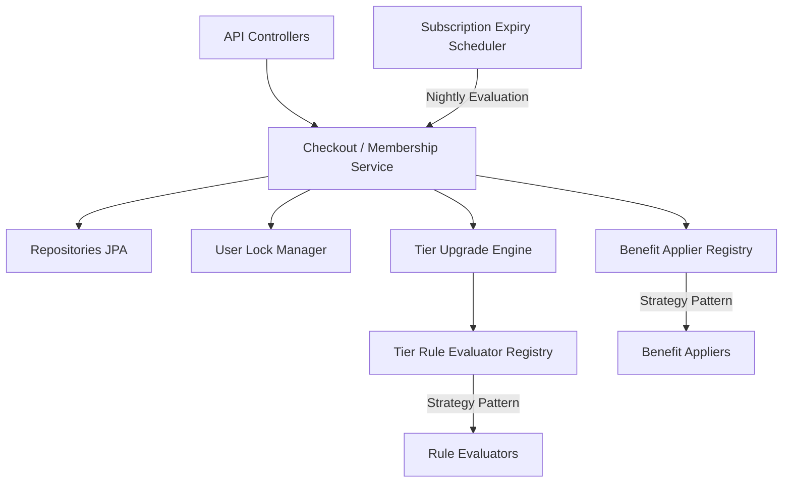
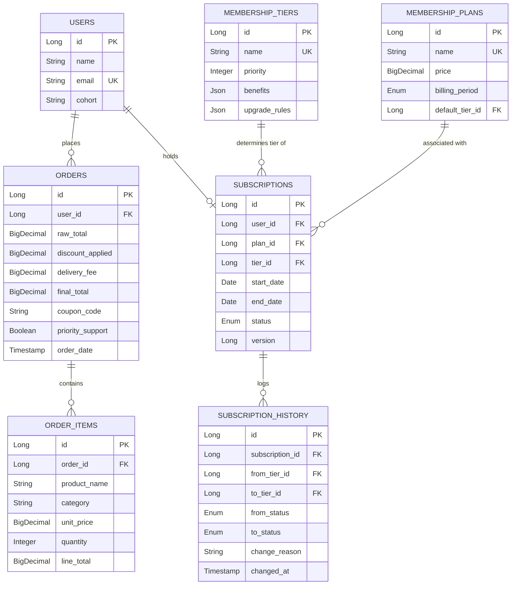

# FirstClub Membership Program Backend

FirstClub is a high-performance, modular Spring Boot application designed to manage dynamic membership subscriptions, evaluate tier upgrade and downgrade rules, and apply member-specific benefits during checkout. 

The system is built on modern architectural principles, featuring a dynamic **Strategy-based Rule & Benefit engine**, **Java 21 Virtual Thread-driven async upgrades**, **scheduled expiration and auto-downgrade evaluation**, and a lock-outside-transaction concurrency model to guarantee safety under concurrent workloads.

---

## 🚀 Key Features

*   **Dynamic Tier & Plan Architecture**: Allows flexible definitions of membership tiers (`SILVER`, `GOLD`, `PLATINUM`) with priorities, distinct rule configurations, and tiered benefits.
*   **Strategy-Pattern Engine**:
    *   **Rule Evaluators**: Decoupled rules (`ORDER_COUNT_THRESHOLD`, `MONTHLY_SPEND_THRESHOLD`, `COHORT_MATCH`) that evaluate user data dynamically under `AND` or `OR` logical operators.
    *   **Benefit Appliers**: Configurable benefits (`PERCENTAGE_DISCOUNT`, `FREE_DELIVERY`, `EXCLUSIVE_COUPON`, `PRIORITY_SUPPORT`) mapped to orders during calculation and checkout.
*   **Virtual Thread Concurrency**: Processes asynchronous tier upgrades in the background using Java 21 Virtual Threads, minimizing latency for the checkout critical path.
*   **Thread Safety with Striped Locking**: Employs Guava `Striped<Lock>` in a lock-outside-transaction pattern, serialized per user, preventing race conditions, optimistic locking failures, and duplicate history records.
*   **Nightly Batch Expiry & Downgrades**: A daily scheduler scans for expired active subscriptions (marking them as `EXPIRED` status) and re-evaluates active subscriptions, dynamically downgrading tiers if metrics are no longer met (but preventing drops below the plan's default tier).
*   **Rigorous Test Suite**: Backed by **61 unit, integration, and concurrency tests** ensuring high logic coverage, error mappings, scheduler correctness, and transactional consistency.

---

## 🏗️ Architecture & Component Design

The application follows a clean layered architecture with a decoupled registry-strategy model for rules and benefits:



### 1. Strategy & Registry Patterns
Instead of hardcoding rules and benefits, the system uses registries that scan and register implementations of [TierRuleEvaluator](file:///Users/ayon/Repos/FirstClub/src/main/java/com/firstclub/membership/strategy/rule/TierRuleEvaluator.java) and [BenefitApplier](file:///Users/ayon/Repos/FirstClub/src/main/java/com/firstclub/membership/strategy/benefit/BenefitApplier.java). 
*   **Rule Configs & Benefit Configs** are stored as JSON structures inside the database, mapping class-independent parameters (e.g. `discountPercent`, `thresholdAmount`) to execution.
*   Supports dynamic combining of rules. For example, a tier can require `(Rule A OR Rule B) AND Rule C` depending on the configured operator parameter.

### 2. Concurrency Control (UserLockManager)
To avoid multiple concurrent checkouts from triggering overlapping upgrades for the same user (which leads to duplicate history logs and `ObjectOptimisticLockingFailureException`), we use a specialized lock manager:
```java
public class UserLockManager {
    private final Striped<Lock> striped = Striped.lock(256);
    
    public <T> T executeWithLock(Long userId, Supplier<T> action) {
        Lock lock = striped.get(userId);
        lock.lock();
        try {
            return action.get();
        } finally {
            lock.unlock();
        }
    }
}
```
*   Locks are held **outside** of Spring transactions. This avoids holding DB connection pool resources while blocking, preventing database deadlocks.
*   The actual database state modification propagates in a new transaction (`Propagation.REQUIRES_NEW`), which executes cleanly inside the lock boundary.

---

## 💾 Database Schema

The database model tracks users, orders, plans, subscriptions, and their chronological history.



---

## 🛠️ Getting Started & Running

### Prerequisites
*   **Java 21** (Required for virtual thread support)
*   **Maven 3.8+** or the included `./mvnw` wrapper

### 1. Build the Project
```bash
./mvnw clean package
```

### 2. Run the Application
The application will automatically boot up and run on `http://localhost:8080`.
```bash
./mvnw spring-boot:run
```
*Note: The application has a `DataSeeder` which automatically populates standard tiers (SILVER, GOLD, PLATINUM), plans (Monthly Basic, Quarterly Plus, Yearly Premium), and seed users on start if the database is empty.*

### 🗄️ H2 Console Details
*   **Path**: `http://localhost:8080/h2-console`
*   **JDBC URL**: `jdbc:h2:mem:firstclubdb`
*   **User Name**: `sa`
*   **Password**: *(leave blank)*

---

## 🔌 API Endpoints Reference

### 1. User Management

#### Retrieve All Registered Users
*   **Endpoint**: `GET /api/users`
*   **Response**: `200 OK`
    ```json
    [
      {
        "id": 1,
        "name": "Arjun Mehta",
        "email": "arjun@firstclub.com",
        "cohort": "PREMIUM_COHORT"
      },
      {
        "id": 2,
        "name": "Priya Sharma",
        "email": "priya@firstclub.com",
        "cohort": "EARLY_ADOPTER"
      }
    ]
    ```

#### Retrieve Specific User
*   **Endpoint**: `GET /api/users/{id}`
*   **Response**: `200 OK`
    ```json
    {
      "id": 1,
      "name": "Arjun Mehta",
      "email": "arjun@firstclub.com",
      "cohort": "PREMIUM_COHORT"
    }
    ```

#### Register User
*   **Endpoint**: `POST /api/users`
*   **Request Body**:
    ```json
    {
      "name": "Alex Smith",
      "email": "alex@test.com",
      "cohort": "PREMIUM_COHORT"
    }
    ```
*   **Response**: `201 Created`
    ```json
    {
      "id": 4,
      "name": "Alex Smith",
      "email": "alex@test.com",
      "cohort": "PREMIUM_COHORT"
    }
    ```

---

### 2. Membership Management

#### List Available Plans
*   **Endpoint**: `GET /api/memberships/plans`
*   **Response**: `200 OK`
    ```json
    [
      {
        "id": 1,
        "name": "Monthly Basic",
        "billingPeriod": "MONTHLY",
        "price": 199.00,
        "defaultTierName": "SILVER"
      },
      {
        "id": 2,
        "name": "Quarterly Plus",
        "billingPeriod": "QUARTERLY",
        "price": 499.00,
        "defaultTierName": "GOLD"
      }
    ]
    ```

#### List Membership Tiers
*   **Endpoint**: `GET /api/memberships/tiers`
*   **Response**: `200 OK`
    ```json
    [
      {
        "id": 3,
        "name": "PLATINUM",
        "priority": 3,
        "benefits": [
          {
            "type": "PERCENTAGE_DISCOUNT",
            "params": { "discountPercent": 20 }
          },
          {
            "type": "FREE_DELIVERY",
            "params": { "minOrderValue": 0 }
          }
        ],
        "upgradeRules": [
          {
            "type": "ORDER_COUNT_THRESHOLD",
            "params": { "threshold": 20, "operator": "OR" }
          }
        ]
      }
    ]
    ```

#### Retrieve Current Membership Status
*   **Endpoint**: `GET /api/memberships/{userId}/status`
*   **Response**: `200 OK` (when subscribed)
    ```json
    {
      "userId": 1,
      "subscriptionId": 1,
      "planName": "Monthly Basic",
      "billingPeriod": "MONTHLY",
      "tierName": "SILVER",
      "tierPriority": 1,
      "status": "ACTIVE",
      "startDate": "2026-06-08",
      "endDate": "2026-07-08",
      "daysRemaining": 30,
      "activeBenefits": [
        {
          "type": "PERCENTAGE_DISCOUNT",
          "params": { "discountPercent": 5 }
        }
      ],
      "progressToNextTier": {
        "nextTierName": "GOLD",
        "rules": [
          {
            "ruleType": "ORDER_COUNT_THRESHOLD",
            "currentValue": 2,
            "requiredValue": 5,
            "met": false
          }
        ]
      },
      "history": [
        {
          "fromTier": null,
          "toTier": "SILVER",
          "reason": "SUBSCRIBE",
          "changedAt": "2026-06-08T22:07:48.246"
        }
      ]
    }
    ```

#### Subscribe to Plan
*   **Endpoint**: `POST /api/memberships/subscribe`
*   **Request Body**:
    ```json
    {
      "userId": 1,
      "planId": 1
    }
    ```
*   **Response**: `201 Created` / `SubscriptionStatusResponse`

#### Manual Upgrade/Downgrade Tier
*   **Endpoint**: `PATCH /api/memberships/{userId}/tier`
*   **Request Body**:
    ```json
    {
      "tierId": 2
    }
    ```
*   **Response**: `200 OK` / `SubscriptionStatusResponse` (history records `MANUAL_UPGRADE` or `MANUAL_DOWNGRADE`)

#### Cancel Subscription
*   **Endpoint**: `DELETE /api/memberships/{userId}`
*   **Response**: `200 OK` (Subscription transitions to `CANCELLED`, history records `CANCEL`)

---

### 3. Checkout Operations

#### Pre-calculate Cart Total and Perks (Preview)
*   **Endpoint**: `POST /api/checkout/calculate`
*   **Request Body**:
    ```json
    {
      "userId": 1,
      "deliveryFee": 50.00,
      "items": [
        {
          "productName": "Keyboard",
          "category": "Electronics",
          "unitPrice": 1200.00,
          "quantity": 1
        }
      ]
    }
    ```
*   **Response**: `200 OK`
    ```json
    {
      "userId": 1,
      "rawTotal": 1200.00,
      "discountApplied": 60.00,
      "deliveryFee": 50.00,
      "finalTotal": 1190.00,
      "couponCode": null,
      "prioritySupport": false,
      "benefitsApplied": [
        "Discount applied: saved ₹60.00"
      ],
      "tierName": "SILVER"
    }
    ```

#### Place Checkout Order
*   **Endpoint**: `POST /api/checkout/place-order`
*   **Request Body**: *(Same as calculate)*
*   **Response**: `200 OK` (calculates, saves items/orders to H2 database, triggers asynchronous Virtual Thread to check upgrade eligibility).

---

### 4. Concurrency Sandbox (Demo Only)

#### Run Concurrency Simulation
*   **Endpoint**: `POST /api/demo/concurrency-test`
*   **Request Body**:
    ```json
    {
      "userId": 1,
      "threads": 10
    }
    ```
*   **Response**: `200 OK` (launches 10 simultaneous checkout threads under user lock to simulate race conditions, logging collision counts and lock outcomes).

---

## 🧪 Testing

The test suite contains **61 comprehensive unit and integration tests** checking:
1.  **Controller REST Mappings & Error Handling** (MockMvc)
2.  **Order Calculation & Capping Boundaries** (e.g. capping discount total to raw total)
3.  **Tier Upgrade Priority & Upgrade Engine Logic**
4.  **Virtual Thread Concurrency & Striped Locking Execution**
5.  **Nightly Batch Scheduling (Expiration and Downgrades)**
6.  **Strategy Parameter Edge Cases & Registry Failures**

Run the complete test suite:
```bash
./mvnw test
```
